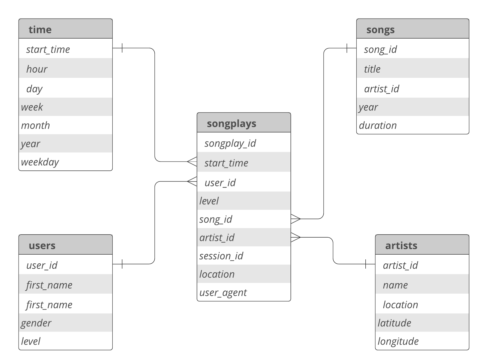

# Building a Data Warehouse on AWS

The scope of the project is to create a **Data Warehouse** for a music application. The source data are stored in a bunch of JSON files in AWS S3 buckets. We process them and extract useful information about users, songs, artists, users' listing information. Next, push extracted data to fact and dimensional tables for further analysis.

## How to Deploy and Run

We have used virtualenv and pip for setting up our Python environment. Setting up the Python environment is fairly easy with virtualenv. You just need to run the following commands to set up the environment.

1. Create a new virtual environment: `virtualenv -p python3.8 venv`
2. Activate it: `source ./venv/bin/activate`
3. Install dependencites: `pip install -r requirements.txt`
4. Create the Redshift cluster and copy its host name, database name, username, password, and aim role.
5. Update your `dwh.cfg` file.

Next, execute two following commands to create your database schema and insert data into the fact and dimensional tables. 

1. To create database schema: `python create_tables.py`
2. To load the data into tables: `python etl.py`

## ETL Pipeline

We employed a two-stage approach to building our extract, transform, load (**ETL**) pipeline:
1. First, we load data (in `JSON` format ) from S3 buckets to two temporary  (Redshift) tables. We used the Redshift `COPY` command to move data from `S2` to Redshift tables. 
2. For moving data from Redshift temporary tables to Fact and Dimensionsional tables, we use INSERT SQL commend. 

## Database Structure

Figure 1 shows the start scheme use used for the project. In our database scheme, we have one **fact table** (`songplays`) and four **dimensional tables** (`users`, `songs`, `artists`, `time`).

We are going to run a lot of analytical queries against our data stored in the database. We have selected star schema because it is the most appropriate database schema for our analytical queries. 

 
 <b>Figure 1</b>: The Database Schema

